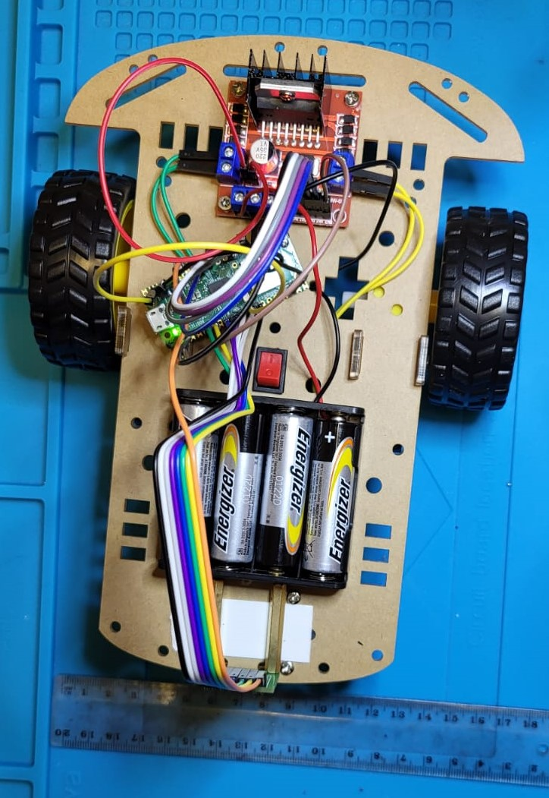
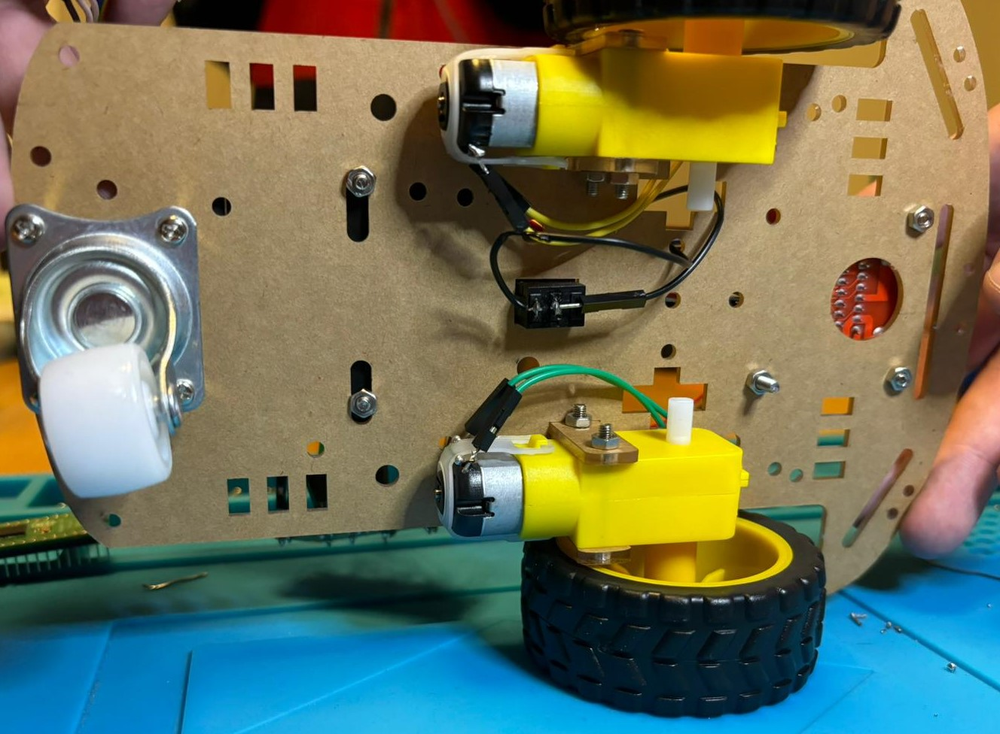
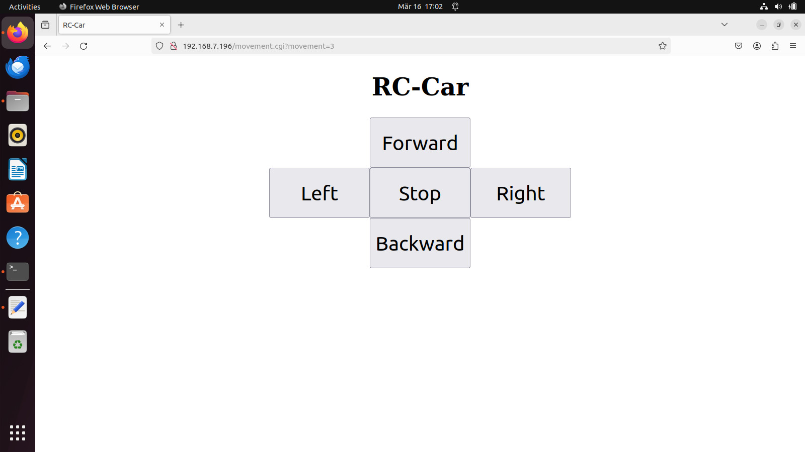

# RC-Car-mit-Kamera
Dieses Repository dient der technischen Dokumentation für ein RC-Car mit Videoübertragung. Die Steuerung und Übertragung der Video-
aufnahmen erfolgt durch einen Raspberry Pi Pico W.

## Benötigte Teile
In dem Ordner Pläne findet sich eine Teileliste. Mit deren Hilfe sollten sich alle benötigten Teile kaufen lassen.
Anstatt sich alle Teile einzeln zu kaufen, ergibt es durchaus Sinn, sich ein Chassis-Set für ein RC-Car zu kaufen.
Preislich landet man bei ca. 15 € und erhält dafür neben dem Chassis auch Reifen, Motoren, Batteriehalter und einen Kippschalter.
Etwaige Kleinteile wie Schrauben und Muttern sind ebenfalls schon enthalten.
Link dazu: https://www.amazon.de/AptoFun-Chassis-Arduino-Getriebemotor-Batteriebox/dp/B01LW6A2YU/ref=sr_1_5?sr=8-5
Nur noch die Kamera, der Raspberry Pi sowie der Motortreiber werden zusätzlich benötigt.
Preislich lassen sich dadurch immerhin ca. 7 € sparen und das Bestellen bei vielen verschiedenen Anbietern entfällt.

## Aufbau
Der Aufbau ist simpel. Alle Teile werden mittels Schrauben auf dem Chassis befestigt.
Die Verbindungen zwischen Raspberry Pi Pico, Motortreiber und Kamera sowie die Verbindung zwischen
Motor und Motortreiber müssen gelötet werden. Im Ordner Pläne findet sich dazu ein Anschlussplan sowie
ein Stromlaufplan für die Verbindung zwischen Raspberry Pi Pico und Kamera/Motortreiber.
Wichtig zu beachten ist die entsprechende Montage der Räder. Das rechte Rad sollte mit den Anschlüssen OUT1 und 2
verbunden werden und das linke Rad mit OUT3 und 4. Dies ist wichtig, da nur so die richtige Fahrtrichtung in Verbindung
mit dem hier gezeigten Quellcode möglich ist.

Die Bilder sollten einen guten Eindruck vermitteln, wie das RC-Car zusammengebaut aussieht.

## Programm
Die Programmierung erfolgt unter C++, da die benötigten Bibliotheken für die ArduCam nur in C++ verfügbar waren.
Der Code befindet sich im entsprechenden Ordner.
Die Bedienoberfläche für das RC-Car wurde per HTML erstellt und ist über den Browser abrufbar über die IP-Adresse des
Raspberry Pi Picos.
Der Raspberry Pi Pico fungiert dabei als Webserver und muss vorher eine Verbindung zu einem W-Lan Netz aufbauen.

## Bedienung
Der Raspberry Pi Pico wird über einen Hotspot an ein Wlan-Netzwerk angeschlossen. Die Verbindungsdaten des Hotspots werden im Programmcode des Raspberry Pi Picos hinterlegt.
Durch Aufruf der IP-Adresse (192.168.7.196) des Picos gelangt man in das Bedieninterface.

Mithilfe der 5 Buttons lässt sich das RC-Car steuern. Ein Tippen auf den jeweiligen Button aktiviert den Befehl. 
Das Auto kann somit nach vorne Fahren, sich nach links oder rechts drehen, Rückwärts fahren oder stoppen.
